# AI 智能客服 — 工具注册→调用→回调 全链路流程图

```mermaid
flowchart TB
    subgraph STARTUP["🔧 启动阶段：工具注册"]
        direction TB
        A1["defaultSchemaTools()"] -->|"定义 20 个 Tool{Name,Desc,Params,Metadata,Handler}"| A2["catalog.DefaultTools()"]
        A2 -->|"组装 RPC 客户端 → HandlerFunc → Tool"| A3["NewRegistry(config, tools)"]
        A3 -->|"存入 registry.metadata + registry.tools"| A4["Registry"]
        A3 -->|"挂载 Executor"| A5["Executor{registry, recorder}"]
        A3 -->|"挂载 ApprovalManager"| A6["ApprovalManager{registry, executor, creator}"]
    end

    subgraph REQUEST["📨 阶段1：请求入口"]
        direction TB
        B1["用户 WebSocket 消息"] -->|"JSON"| B2["apis/ai 网关"]
        B2 -->|"gRPC Chat(ChatRequest)"| B3["AiAgentServer.Chat()"]
        B3 -->|"校验 UserID/Content"| B4["ChatLogic.Chat()"]
        B4 -->|"幂等检查 → 构建上下文 → runSupervisor()"| B5["AgentRunner.Stream()"]
    end

    subgraph EINO["🧠 阶段2：Eino Agent 编排"]
        direction TB
        C1["agent.Stream()"] -->|"1. 注入信任上下文 ToolExecutionContext{UserID}"| C2["WithToolExecutionContext(ctx, exec)"]
        C2 -->|"2. 转换消息 → []*schema.Message"| C3["ConvertContextMessages()"]
        C3 -->|"3. 创建 CallbackBridge"| C4["newAgentEventCallbackBridge()"]
        C4 -->|"4. 启动 ADK Runner"| C5["adk.NewRunner().Run(ctx)"]

        subgraph AGENTS["5个子Agent（Supervisor调度）"]
            C5A["supervisor_agent"]
            C5A -->|"路由"| C5B["product_agent<br/>tools: search/detail/recommend/inventory"]
            C5A -->|"路由"| C5C["order_agent<br/>tools: get/list/cancel"]
            C5A -->|"路由"| C5D["cart_checkout_agent<br/>tools: cart_*/checkout_*/order_create"]
            C5A -->|"路由"| C5E["coupon_agent<br/>tools: coupon_*"]
            C5A -->|"兜底"| C5F["general_agent<br/>无工具，纯对话"]
        end
    end

    subgraph TOOLCALL["⚙️ 阶段3：模型 ToolCall → 工具适配"]
        direction TB
        D1["LLM 决定调用工具<br/>输出 tool_call{name, arguments}"] -->|"Eino ToolsNode"| D2["invokableToolAdapter.InvokableRun(ctx, argumentsJSON)"]
        D2 -->|"1. ToolExecutionFromContext(ctx)"| D3{"ctx 中有<br/>ToolExecutionContext<br/>且 UserID≠0?"}
        D3 -->|"❌ 缺失"| D3E["返回 ErrToolExecutionContext<br/>拒绝执行"]
        D3 -->|"✅ 通过"| D4["2. json.Unmarshal → args map"]
        D4 -->|"3. 注入 UserID + Metadata"| D5["Executor.Execute(ctx, ExecuteRequest, handler)"]
    end

    subgraph EXECUTOR["🛡️ 阶段4：Executor 核心执行"]
        direction TB
        E1["Executor.Execute()"] -->|"1. registry.Metadata(name)"| E2["获取 Risk / Timeout / WriteOperation"]
        E2 -->|"2. argx.SanitizeMapKeys()"| E3["清除 user_id/token/session_id"]
        E3 -->|"3. context.WithTimeout()"| E4["查询 3s / 写操作 5s"]
        E4 -->|"4. runHandlerWithTimeout()"| E5["执行 HandlerFunc(ctx, HandlerRequest)"]
    end

    subgraph HIGHRISK["⚠️ 高风险工具分支"]
        direction TB
        F1{"RequiresConfirmation<br/>?Risk=high && WriteOp && Confirm"} -->|"首次调用"| F2["highRiskApprovalMiddleware<br/>.WrapInvokableToolCall()"]
        F2 -->|"createApprovalInfo()"| F3["einotool.StatefulInterrupt<br/>(ctx, info, storedArgs)"]
        F3 -->|"ADK 中断"| F4["生成 EventConfirmationRequired<br/>→ WebSocket → 前端确认卡片"]

        F4 -->|"用户点击确认/拒绝"| F5["ConfirmAction RPC"]
        F5 -->|"ConfirmationManager.Decide()"| F6{"决策?"}
        F6 -->|"approved"| F7["AgentRunner.ResumeStream()<br/>注入 ApprovalResult{Approved:true}"]
        F7 -->|"恢复执行"| F1
        F6 -->|"rejected/expired"| F8["返回 '操作已取消' 事件"]

        F1 -->|"resume 且 approved"| E5
    end

    subgraph HANDLER["📡 阶段5：HandlerFunc → 业务 RPC"]
        direction TB
        G1["HandlerFunc(ctx, HandlerRequest)"] -->|"1. authenticatedUserID32()"| G2["从信任上下文取 UserID<br/>（不是从模型参数！）"]
        G2 -->|"2. requiredXxxArgument()"| G3["从 args 提取参数并校验"]
        G3 -->|"3. 调用业务 RPC"| G4["rpc.CreateOrder() / QueryProduct() / ..."]
        G4 -->|"4. validateRPCResponse()"| G5["检查 StatusCode / StatusMsg"]
        G5 -->|"5. 构建结果"| G6["HandlerResult{Data, Summary}"]
    end

    subgraph CALLBACK["📤 阶段6：结果回传 + 审计"]
        direction TB
        H1["Executor 收到 HandlerResult"] -->|"构建 AgentEvent"| H2{"执行结果?"}
        H2 -->|"成功"| H3["EventToolResult<br/>{DataJSON, Content=Summary, BusinessExecuted}"]
        H2 -->|"超时"| H4["EventToolResult<br/>{Content='工具调用超时，未完成操作'}"]
        H2 -->|"失败"| H5["EventError<br/>{Content=错误信息}"]

        H3 -->|"审计记录"| H6["recorder.RecordToolCall()"]
        H6 -->|"写入"| H7[("ai_tool_calls 表")]
        H6 -->|"写操作额外"| H8[("audit RPC")]

        H3 -->|"agent.consumeEvents()"| H9["callback bridge → chan AgentEvent"]
        H9 -->|"非瞬态事件持久化"| H10[("ai_messages 表")]
        H9 -->|"gRPC stream"| H11["apis/ai → WebSocket → 前端"]
    end

    STARTUP --> REQUEST
    REQUEST --> EINO
    EINO --> TOOLCALL
    TOOLCALL --> EXECUTOR
    EXECUTOR -->|"低风险工具"| HANDLER
    EXECUTOR -->|"高风险工具"| HIGHRISK
    HIGHRISK -->|"确认通过后"| HANDLER
    HANDLER --> CALLBACK

    style D3 fill:#ff6b6b,color:#fff
    style D3E fill:#ff4444,color:#fff
    style F1 fill:#ffa500,color:#fff
    style G2 fill:#4ecdc4,color:#fff
    style E3 fill:#4ecdc4,color:#fff
```



## 关键安全节点说明

| 节点 | 安全机制 |
|---|---|
| 🔴 `ToolExecutionFromContext` 校验 | UserID 缺失直接拒绝，模型参数不可信 |
| 🟠 `StatefulInterrupt` 中断 | 高风险操作暂停执行，等待用户确认 |
| 🟢 `argx.SanitizeMapKeys` | 清除 user_id/token 等敏感字段后记录 |
| 🟢 `authenticatedUserID32` | Handler 层从信任上下文取 UserID，不由模型提供 |

## 数据流总结

```
注册: defaultSchemaTools() → Registry{metadata, tools, executor}
调用: LLM tool_call → invokableToolAdapter → Executor.Execute() → HandlerFunc → 业务 RPC
回调: HandlerResult → AgentEvent → consumeEvents → 持久化 + WebSocket
确认: StatefulInterrupt → ConfirmationRequired → ConfirmAction → ResumeStream → 继续执行
```
